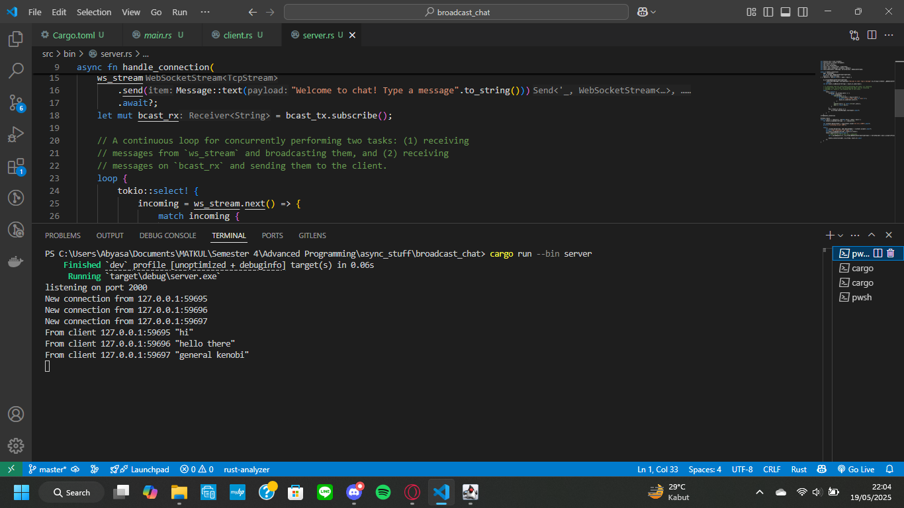
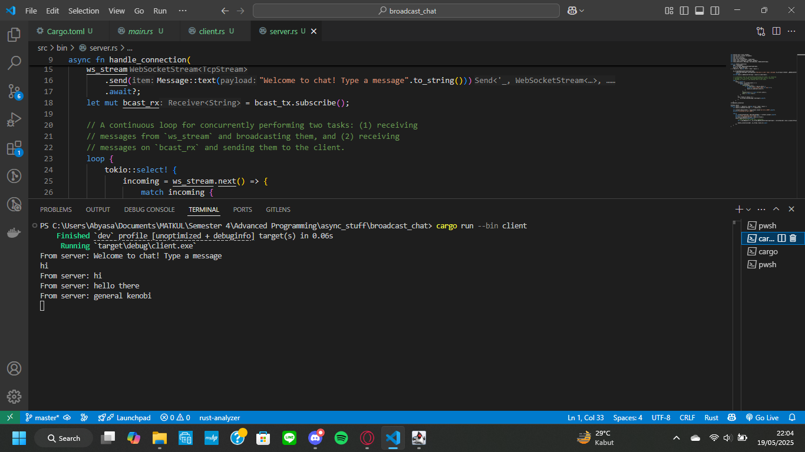
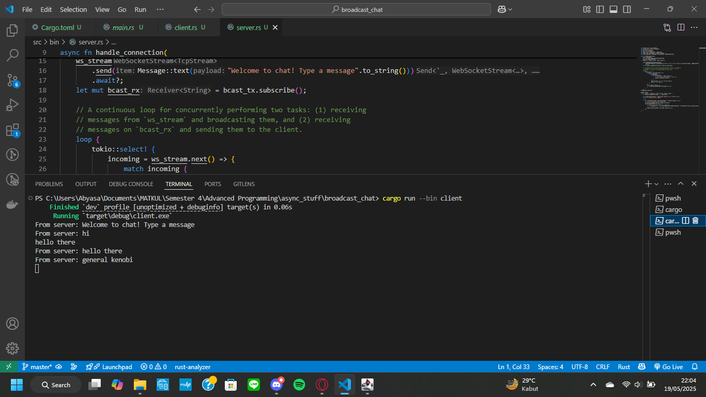
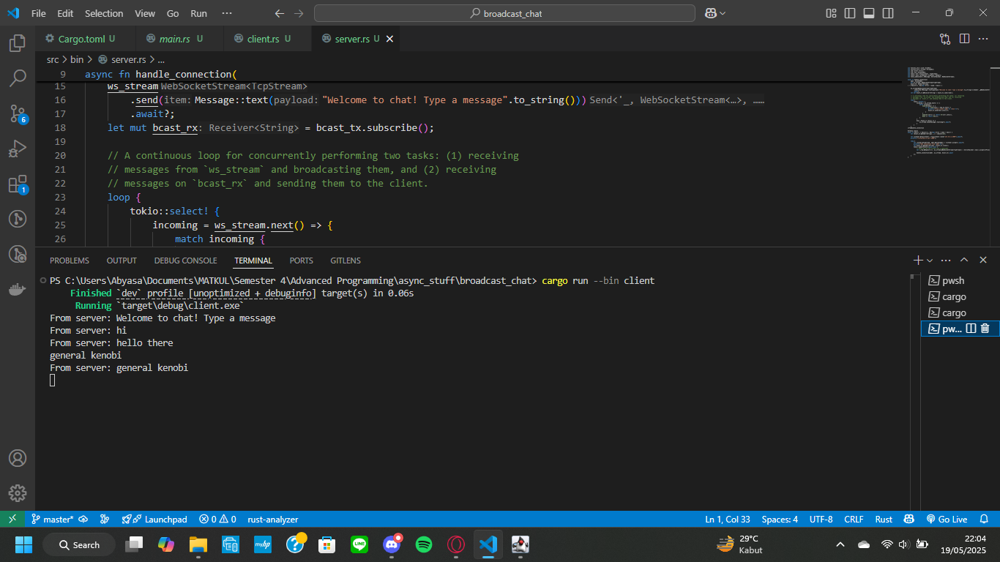
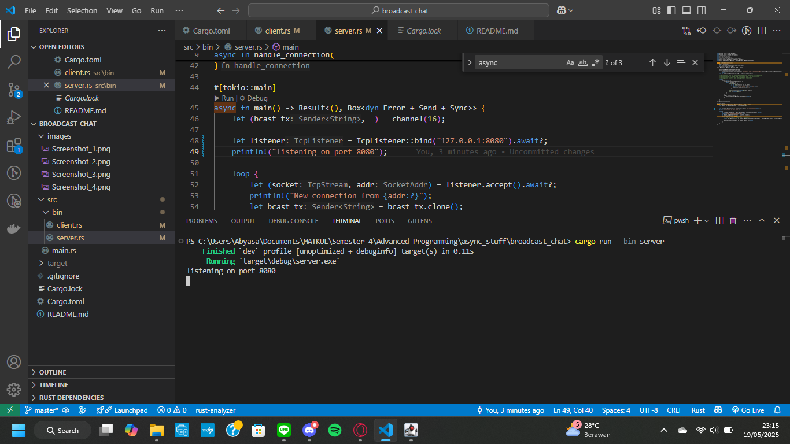
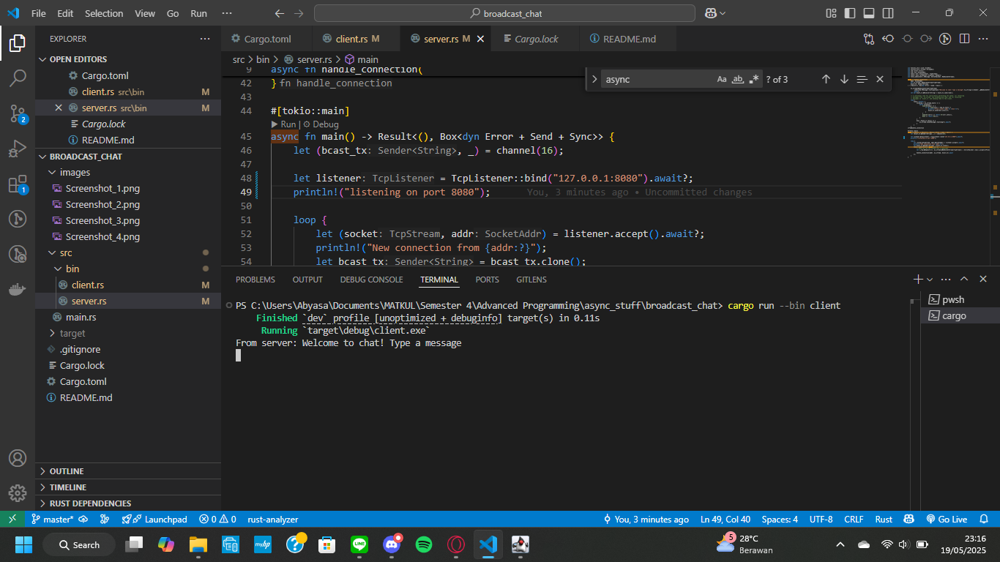
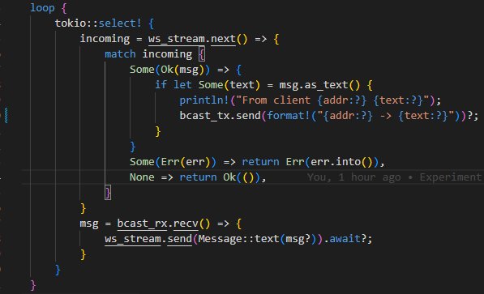
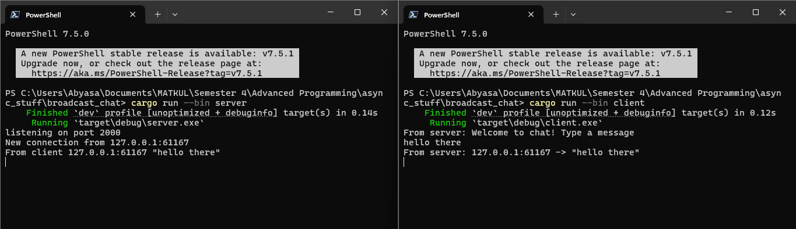

## Refleksi Tutorial 10: Broadcast Chat

Secara garis besar, program _broadcast chat_ ini bekerja dengan mengirim, menerima, dan menyiarkan pesan secara asinkronus dan sisi server dan klien. Kedua sisi dijalankan menggunakan `cargo run --bin server` dan `cargo run --bin client`, di mana server dan klien akan terhubung pada _localhost_ port 2000. Tiap klien yang terhubung ke _channel_ tersebut akan terdeteksi dan ditampilkan pada server. Klien bisa menerima input pesan yang dimasukkan _user_ yang kemudian akan dikirim ke server melalui WebSocket (`ws_stream.send()`). Secara bersamaan, klien juga bisa menerima pesan yang datang dari server melalui WebSocket (`ws_stream.next()`) dan mencetaknya di konsol. Sementara itu, server menyediakan _channel_ dengan kapasitas 16 _message_ yang memungkinkan beberapa klien untuk menerima pesan secara _concurrent_. Secara asinkronus, server berfungsi untuk menangani pesan yang dikirim oleh klien dengan mencetaknya di konsol dan menyiarkan pesan tersebut. Selain itu, server juga menerima pesan yang disiarkan melalui _broadcast receiver_ (`bcast_rx`) dan mengirimnya ke klien melalui WebSocket (`ws_stream.send()`).
 

Pada sisi klien (`client.rs`), alamat server pada WebSocket diganti menjadi `ws//127.0.0.1:8080`. Sementara itu, sisi server menggunakan _TCP listener_ yang terhubung ke alamat server yang sama dengan klien (dalam hal ini di-_set_ menjadi `127.0.0.1:8080`). Jika terdapat klien yang menginisiasi koneksi WebSocket, server akan menerima koneksi tersebut dan memasukkan koneksi TCP-nya ke dalam WebSocket untuk berkomunikasi dengan klien.
 

Terdapat modifikasi kode pada `server.rs`, lebih tepatnya pada _method_ `handle_connection`. Kini, pesan yang diterima server dari suatu koneksi WebSocket dengan klien akan disiarkan kembali oleh _broadcast sender_ (`bcast_tx`) bersama dengan informasi IP dan port (`addr`) dari klien yang bersangkutan.